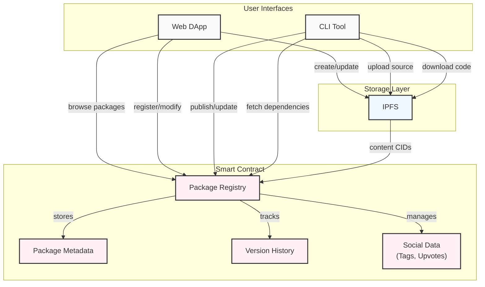

# Stylus Package Manager

Stylus package manager transforms Web3 development by giving developers access to public verifiable on-chain directory of smart contract packages.




## Deployments

- V1 - `0x9a6ad25b3ea706008a31b877823def127442f63b`

- V2 - `0xf7b19f8b30967724a32a0995d5f767e620030af8`

- V3 - `0x7a394022193f9bab8a6660df4c418c0b5a6aa315`

## Setup

- `git clone <reppo>`
- `cd dapp && npm i` to install dependencies
- run dapp using `npm run dev`

## Usage

- deploy Stylus smart contract with:

```bash
cargo stylus deploy \
  --endpoint='http://localhost:8547' \
  --private-key="0xb6b15c8cb491557369f3c7d2c287b053eb229daa9c22138887752191c9520659" \
  --estimate-gas
```

## Features

- Package information stored directly on-chain in smart contract directory
- Package versioning
- Package build verification, source code, security audit status
- Retrieval of data and browsing packages in dapp
- CLI tool for fetching packages from smart contract and managing dependencies

## Contact

- tg - **Someone_Nevv**
